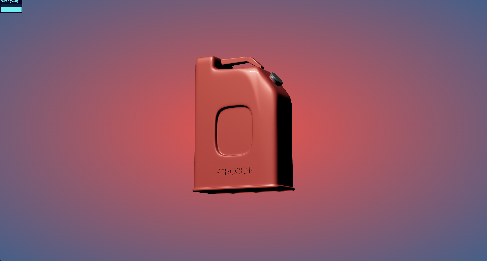

# R3F Kerosene :fire:

Quick-start framework for performant, reusable, real-time 3D apps using React and Three.js.

## Get Started

To install all dependencies run:
```
npm i
```
Then start the production server and make changes in real-time with:
```
npm start
```

### Modularity

Using JSX components, react-three-fiber leverages the ability to reuse models and scenes, calling them within the Canvas as easily as any other react component in the DOM.

### GLTF > JSX

Export a .gltf or .glb file from Blender, C4D, Maya, CLO, Fusion360 etc. To create a reusable .jsx component from your scene/model you can drag and drop the .gltf into https://gltf.pmnd.rs/ and copy/paste the code into a new component. Alternatively this can be converted in the command line if your .gltf is already in your public folder by running:
```
npx gltfjsx model.gltf
```
replacing model.gltf with your file in the public folder.

### Materials

For ideal GLTF material exports to three.js refer to your specific programs documentation, like Blender's (https://docs.blender.org/manual/en/2.80/addons/io_scene_gltf2.html#). Some materials may need to be baked to export to glTF, so if your scene/model looks unsatisfactory, this is probably the case.
